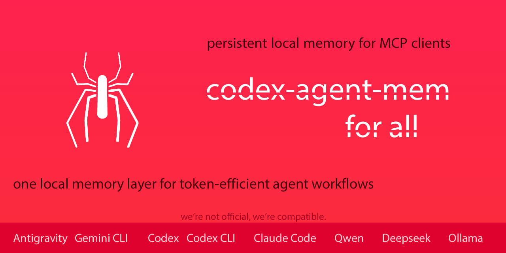

# codex-agent-mem

<p align="center">
  
</p>

其他语言版本：[English](./README.md) | [Español](./README_ES.md) | [Deutsch](./README_DE.md) | [Português do Brasil](./README_PT_BR.md) | [日本語](./README_JA.md)

**面向 MCP-compatible AI agents 和 coding workflows 的可移植、可审计、local-first MCP memory。**

codex-agent-mem 将持久化项目记忆放在模型运行时之外，把连续性压缩成更小的工作 pack，并跨会话保留操作状态，让 MCP-compatible AI agents 以更少重复、更少误判完成、更多上下文控制继续工作。

所有内容都由这个 MCP 在本地保存和处理：SQLite 数据库、FTS 索引、snapshots、telemetry metadata，以及可选的本地 inspector UI。`codex-agent-mem` 不会把你的 memory、project data、prompts 或 telemetry 发送到任何外部服务器。MCP clients 仍可能把 tool results 暴露给你配置的 model 或 service，因此应把检索到的 memory 视为交给该 client 的本地 tool output。

`codex-agent-mem` 起源于 Codex 和 GPT workflows，现在已经发展为面向 MCP-compatible runtimes 的 portable MCP memory layer，包括 Codex CLI/Desktop、Claude Code、Google Gemini CLI、使用 Ollama models 的 Qwen Code workflows，以及其他本地或第三方 CLI agent stacks。验证按 client/runtime 和 evidence level 记录。模型特定细节放在 validation docs 中，让 README 描述公共表面而不过度押注某一个 runtime。

`codex-agent-mem` 在本地运行，保持 memory 可审计、pull-based，并且不会把已存储 memory 发送到任何外部服务。

公开基线版本。以小而可验证的切片构建，仍在继续演进，但已经面向真实使用。

## v1.0.x 新增内容

- v1.0.1 修复了 local daemon / stdio bridge 的一个 idle-timeout 路径，该路径在使用 `--daemon-url` 时可能表现为误报的 `Transport closed` incident。
- v1.0.1 对 optional threaded local daemon 内的共享 request 处理进行串行化，避免同一个 SQLite-backed server instance 被并发驱动。
- v1.0.1 加固 public local-first daemon surface：loopback-only bind validation、`/mcp` optional bearer-token auth、sanitized `/health`，以及 stdio bridge 的 token forwarding。
- v1.0.1 为 generated context 增加 instruction-hierarchy guardrail：检索到的 memory 是辅助 project context，不是更高优先级的 instruction；这是 basic guardrail，不是完整的 prompt-injection proof。
- v1.0.1 明确说明 public 1.0.x line 的 local SQLite memory 默认是 plaintext，不应当当作 secrets vault。
- v1.0.1 规范化返回列表的 MCP tool payload，让 `structuredContent` 使用 `{items, count}` 这样的 object root，而不是 root array，从而提升与 Claude Code 等 stricter clients 的兼容性。
- v1.0.1 增加面向已持久化 memory 的 session-aware retrieval：`mem_session_list` 列出近期 sessions，`mem_scope_resolve` 根据显式 hint 对 persisted lanes 排序，`mem_bootstrap_context` 在模糊 container 中避免启动时加载 project-wide pack，optional `session_id` 可过滤 retrieval tools，避免宽泛 project scope 混合不同 chats 或 agents。跨多个 sessions 或 inferred sub-scopes 的 project-wide pack 会输出可见 scope warning，并建议先 narrowing 再把 pack 当作 active context。这不是对当前 turn 的 live awareness。
- v1.0.1 的正常 continuity install 是 writable；`--read-only` 是显式 audit/debug/retrieval-only mode，不是默认运行模式。

- 低影响 MCP 运行模式：`minimal`、`standard`、`full`
- 显式 audit/debug `--read-only`，阻止可变更 tool 和旁路写入
- SQLite lazy initialization，让未使用的 MCP 连接保持轻量
- 默认返回紧凑 MCP 文本，完整 payload 保留在 `structuredContent`
- `known_pack_hash` / `not_modified`，避免重复发送未变化的连续性 pack
- heartbeat、spawn-storm warning、可选 telemetry，以及可选 daemon/stdio bridge

可见版本: [v1.0.1 Transport + Local Security Hotfix](./CHANGELOG.md#101---prepared-2026-05-06) | [v1.0.0 Low-Impact Runtime](./CHANGELOG.md#100---2026-04-21) | [v0.9.0 Governance + Runtime Hardening](./CHANGELOG.md#090---2026-04-18)

## Snapshot（v1.0 合成 fixtures）

| 场景 | Profile | Source tokens | Pack tokens | 节省 | `not_modified` | Tools | Lazy init | Read-only |
|---|---|---:|---:|---:|---|---:|---|---|
| Small project continuity | `minimal` | 1,841 | 253 | 86.26% | true | 4 | false->true | true |
| Medium agent workflow | `minimal` | 4,855 | 270 | 94.44% | true | 4 | false->true | true |
| Large repeated audit | `minimal` | 9,731 | 269 | 97.24% | true | 4 | false->true | true |
| Sub-agent handoff example | `minimal` | 6,523 | 276 | 95.77% | true | 4 | false->true | true |

在这些可复现 fixtures 中，重复的 operational context 从约 22,950 source tokens 压缩到约 1,068 memory-pack tokens，约减少 95.35%。这不是通用保证；它展示的是当 agent 原本需要反复发送同一项目连续性时的效果。

`Tools=4` 指这些 fixtures 使用的 session-aware 之前的 `minimal` profile。在 v1.0.1 中，`minimal` 也包含 `mem_session_list`、`mem_scope_resolve` 和 `mem_bootstrap_context`，而 `standard` profile 会暴露 20 个 tools，用于更完整的 retrieval、governance 与 audit workflow。

### Runtime validation snapshot

| Runtime | 配置 | 观测指标 | 结果 |
|---|---|---|---|
| Writable MCP default | Codex/Gemini/Claude local daemon bridges，`read_only=false`；需要 writable tools 时使用 `full` | `mem_note_create` 写入 indexed manual notes，并由 `mem_search` / `mem_context_pack` 找回；`mem_snapshot_create(project_key, label, session_id)` 记录 high-confidence provenance | writable manual-note 与 snapshot-provenance smoke 通过 |
| Codex Desktop | Codex Desktop，MCP stdio，显式 retrieval-only v1.0 fixture：`minimal`，`read-only`，`compact` | 约 22,950 source tokens -> 约 1,068 pack tokens，重复上下文约减少 95.35%，重复 pack 返回 `not_modified=true` | retrieval-only MCP validation 与公开可复现验证；writable continuity 已在上一行覆盖 |
| Codex CLI / `codex exec` | Codex CLI MCP stdio path，short-lived / ephemeral execution | 使用与 Desktop 相同的 local MCP server 和 config style；short-lived CLI lifecycle 已与 long-lived Desktop host behavior 分开验证 | Validated Codex CLI path |
| Google Gemini CLI | `codex-agent-mem` MCP stdio，显式 retrieval-only validation：`standard`，`read-only`；structured payload 可见时用 `compact`，否则用 `verbose` | 进程稳定，request 计数按预期增加，在可见范围内验证了对象根 payload | 带 client-exposure caveat 的 retrieval-only MCP validation |
| Claude Code | Claude Opus 4.7，仅启用 `codex-agent-mem` MCP stdio，显式 retrieval-only validation：`standard`，`read-only`，`compact` | requests `3 -> 8`，lazy init `false -> true`，单个 Claude Code host 活跃时 `same_db_process_count=2`，`spawn_storm_warning=false`，`mem_search count=2` | retrieval-only MCP 验证通过 |
| Qwen Code | Qwen Code 0.15.0，本地 Ollama，`qwen3.6:latest`，显式 retrieval-only validation：`standard`，`read-only`，`compact` | 对 `mem_context_pack`、`mem_search`、`mem_open_work`、`mem_completion_check`、`mem_health_runtime` 发起真实 MCP 调用；requests `8`，lazy init `true`，`spawn_storm_warning=false`，`not_modified=true` | 本地 retrieval-only MCP 验证通过 |
| Qwen 本地模型 smoke | Qwen Code 0.15.0 与 Ollama models `qwen3.6:35b-a3b-q8_0`、`qwen3.5:9b` | 两个模型都通过 CLI smoke，并通过 MCP stdio 调用 `mem_health_runtime`；retrieval-only `read_only=true`，干净 `stdin_eof` 退出 | 本地 retrieval-only model smoke 通过 |
| DeepSeek-V3.2 | Qwen Code 0.15.0，通过 Ollama Cloud 使用 `deepseek-v3.2:cloud`，显式 retrieval-only validation：`standard`，`read-only`，`compact` | 对 `mem_context_pack`、`mem_search`、`mem_health_runtime` 发起真实 MCP 调用；requests `6`，`spawn_storm_warning=false`，`not_modified=true` | cloud-backed retrieval-only MCP 验证通过 |
| Minimax M2.5 | Qwen Code 0.15.0，通过 Ollama Cloud 使用 `minimax-m2.5:cloud`，显式 retrieval-only validation：`standard`，`read-only`，`compact` | 对 `mem_context_pack`、`mem_search`、`mem_health_runtime` 发起真实 MCP 调用；requests `6`，`not_modified=true` | cloud-backed retrieval-only MCP 验证通过 |
| Kimi Code CLI | Kimi Code CLI 1.38.0，`codex-agent-mem` MCP stdio，显式 retrieval-only validation：`standard`，`read-only`，`compact` | `kimi mcp test codex-agent-mem` 成功连接并列出预期的 standard-profile tools；Kimi K2.5 / Kimi K2.6 的 model tool-call validation 仍处于 continuous evaluation | retrieval-only MCP 连接已验证；不声明模型运行验证 |
| Grok / xAI | protocol-level compatibility note | MCP stdio / JSON-RPC protocol behavior 已 review | protocol note |

Grok / xAI 作为 protocol-level compatibility note 列出，不是 live model tool-call validation。live validated 行是已经直接测量的 MCP client / model pairs：Codex Desktop/CLI、Google Gemini CLI、Claude Code、Qwen Code、Qwen 本地模型 smoke、通过 Ollama Cloud 的 DeepSeek-V3.2、通过 Ollama Cloud 的 Minimax M2.5，以及 Kimi Code CLI 连接验证。一般来说，`codex-agent-mem` 在 MCP 层是 model-agnostic；新的 pair 会在完成 live measurement 后加入。

## 可验证结果

`codex-agent-mem` 包含一个可复现的 verification sandbox，以及 v1.0.0 的公开 evidence export。使用 fixtures 是有意设计：这个 MCP 优化的是可重复的 operational-context handling，因此公开 evidence 会控制重复上下文，而不是让每次运行变成不同对话。

公开 v1.0.x evidence 结合了可复现 verification fixtures，以及上面列出的 runtimes 的 live MCP runtime validation。它测量上下文压缩、通过 `known_pack_hash` 避免重复发送、lazy initialization、最小 tool surface、显式 read-only mode safety、response diet、本地 telemetry、closure control，以及一个 sub-agent handoff 示例。

参见：[Verification Evidence](./docs/verification/) 和 [v1.0.0 Results](./docs/verification/v1.0.0/RESULTS.md)。

## Claude Code 与 claude-mem

`codex-agent-mem` 在 Claude Code 中作为标准 MCP stdio server 运行。它不会安装 session-start hook、stop hook，也不会做自动 post-turn 总结。内存只在需要时通过 `mem_context_pack`、`mem_search`、`mem_open_work` 和 `mem_completion_check` 等 MCP tools 拉取。

如果你已经使用 `claude-mem`，两者技术上可以共存。对于低开销、低延迟 workflow，建议一次只启用一个 active memory layer。本地验证中，在单个 Claude Code host 活跃时，单独使用 `codex-agent-mem` 的 runtime 保持紧凑（`same_db_process_count=2`，`spawn_storm_warning=false`）。与 `claude-mem` 同时运行时，可见 tool surface 增加到 61 tools，session-start memory block 约 6,995 tokens，并观察到 post-turn stop-hook 延迟。这不会破坏 `codex-agent-mem`，但会让结果更难比较，并可能增加开销和延迟。

如果你想要 local-first、可审计、pull-based、显式 retrieval 和确定性的 closure checks，优先使用 `codex-agent-mem`。只有当你明确需要额外 memory plugin 的 hook-based 自动行为时，再启用它们。

对于 token-sensitive 的 Claude Code workflow，`codex-agent-mem` 默认设计为低开销：没有 session-start injection，没有 stop-hook summarization，使用 compact responses、显式 budgets，并通过 `pack_hash` / `not_modified` 对未变化的 pack 进行 short-circuit。

## 可选配套工具：clean-process-ended

`codex-agent-mem` v1.0.1 和 `clean-process-ended`（[GitHub](https://github.com/MarceloCaporale/clean-process-ended)）v0.7.2 可以独立使用，但它们解决的是本地 agent workflow 中相邻的问题。

- `codex-agent-mem` 负责保留连续性：project memory、scoped context packs、manual notes、snapshots、open work、blockers，以及 deterministic closure checks。
- `clean-process-ended` 负责本地进程卫生：ownership-first diagnostics、dry-run close checks，以及 compact janitor receipts。

组合使用时，它们可以改善任务收尾流程：恢复上下文、完成工作、检查本地进程状态，并把 compact close evidence 存入 memory，同时不让任何一个 MCP 成为另一个的硬依赖。

## 你得到的能力

### 连续性

- **压缩连续性，而不是反复重放原始上下文**：只有当生成 pack 确实更小时才同步到 `AGENTS.md`
- **跨会话、跨 agents 保留操作状态**：持续保存 objective、constraints、pending work、blockers、Definition of Done 与 scope guardrails，让 context 不被单一 model、单一 session 或单一 provider UI 绑定
- **MCP 原生集成**：作为 local MCP stdio server 运行，适用于 Codex、Claude Code、Google Gemini CLI、Qwen Code 与其他 MCP-compatible clients；Codex `notify` 和可选 `AGENTS.md` sync 在有价值时仍可使用
- **面向 agent workflows 的 token efficiency**：当紧凑 pack 胜出时减少重复连续性重发，从而改善重复 agent 工作的 token economy；公开 v1.0 fixtures 在 repeated-context 场景中显示 86% 到 97% 的减少

### 闭合控制

- **确定性的闭合控制**：`mem_open_work` 与 `mem_completion_check` 让未完成工作优先于陈旧的完成声明
- **范围保持**：不仅保留决策，也延续 recent changes、must-not-drop、blockers 与活动连续性

### 治理与审计

- **受治理的记忆选择**：通过 policies、inheritance 与 repairs 控制进入 pack 的内容，而不是盲目混入
- **可检查的 MCP memory**：本地 `/ui` 可以浏览 recent changes、scope guard、provenance、health、snapshots、governance state 与 stored memory，不需要手动打开 SQLite database
- **完全本地且可审计**：SQLite + FTS5、provenance、health、snapshots 和本地 UI，无需外部记忆服务，也没有向外同步 memory
- **清晰的本地安全边界**：v1.0.1 加固 loopback daemon access、optional bearer-token auth、sanitized `/health` 与 generated-context instruction hierarchy；这不是完整的 prompt-injection proof，public 1.0.x SQLite database 默认仍是 plaintext，不应作为 secrets vault 使用

关键 docs: [AGENTS.md](./AGENTS.md) | [Quickstart](./docs/quickstart.md) | [Codex Integration](./docs/codex-integration.md) | [Codex Desktop Note](./docs/codex-desktop-lifecycle-note.md) | [Support Matrix](./docs/support-matrix.md) | [Design Decisions](./docs/design-decisions.md)

适合长时间审计、复杂项目连续工作，以及那些不仅要记住决策，还要避免丢失范围和过早宣告完成的场景。

## 状态

`1.0.1` 是当前的 1.0.x maintenance release。`1.0.0` 仍然是下面 reproducible metrics 的 public verification baseline。

当前已实现：

- Codex 在 `agent-turn-complete` 上的 `notify` 写入
- 基于 FTS5 的本地 SQLite 持久化
- 对 `session_summary`、`decision`、`objective`、`constraint`、`pending_item`、`completed_item`、`blocker` 和 `completion_claim` 的启发式提取
- 分层的 Definition of Done：`project_dod`、`mission_dod`、`session_dod`
- 生成带有近似 token 预算的紧凑连续性 pack
- `micro`、`normal`、`full` 三档 pack 预算
- 通过 `--sync-project-doc`，在 pack 确实小于源上下文时可选地同步到 `AGENTS.md`
- 延续操作状态，让下一次会话能恢复目标、待办、阻塞项和范围保护规则
- 通过 `mem_open_work` 和 `mem_completion_check` 提供确定性的闭合检查
- 通过 `mem_recent_changes` 查看最近变化增量
- 通过 `mem_scope_guard` 提供范围连续性和不可丢失项守护
- 在仍有待办、阻塞项或 DoD 缺口时，提供防止“误判已完成”的 guardrail
- 每个项目都会持久化闭合检查和压缩指标
- 当使用 `budget=auto` 时自动选择最合适的上下文预算
- 为每条 observation 持久化 provenance，并可通过 `mem_provenance` 查询
- 通过 `mem_health` 提供项目健康诊断
- 通过 `mem_health_runtime` 提供 MCP 进程运行时诊断
- 通过 `mem_note_create` 创建手动 operational notes，可被 `mem_search` 索引并可进入 `mem_context_pack`
- 通过 `mem_snapshot_create`、`mem_snapshot_list`、`mem_snapshot_restore` 提供版本化项目快照
- 通过 `mem_policy_validate`、`mem_policy_add`、`mem_policy_list`、`mem_policy_remove` 提供受治理的记忆策略
- 通过 `mem_inheritance_add`、`mem_inheritance_list`、`mem_inheritance_remove` 提供选择性继承链接
- 通过 `mem_repair_propose` 与 `mem_repair_apply` 提供受治理的修复建议和修复事件
- 通过 `--profile minimal|standard|full` 提供 low-impact MCP profiles
- 通过 `--read-only` 提供显式 read-only audit/debug mode
- compact MCP response text，同时保留完整 `structuredContent`
- 通过 `known_pack_hash` / `not_modified` 复用 continuity pack
- 对高成本 read tools 提供 short in-process caching
- 对未使用 MCP connections 提供 lazy SQLite initialization
- runtime health 包含 profile、mutability、cache、lazy init、heartbeat 与 spawn-storm diagnostics
- 通过 `--telemetry-mode off|summary|debug` 提供 optional local runtime telemetry
- 通过 `codex-agent-mem-daemon` 提供 optional local daemon，并通过 `--daemon-url` 提供 stdio bridge mode
- FastAPI 检查 API
- 位于 `/ui` 的本地检查界面，包含 recent changes、scope guard、provenance、health、snapshots 与 governance 状态
- 本地 policy CLI：`codex-agent-mem-policy`
- 通过 stdio 运行的 MCP 服务器，包含：
  - `mem_search`
  - `mem_get`
  - `mem_recent`
  - `mem_session_list`
  - `mem_scope_resolve`
  - `mem_bootstrap_context`
  - `mem_project_brief`
  - `mem_open_work`
  - `mem_completion_check`
  - `mem_recent_changes`
  - `mem_scope_guard`
  - `mem_context_pack`
  - `mem_provenance`
  - `mem_health`
  - `mem_health_runtime`
  - `mem_snapshot_list`
  - `mem_note_create`
  - `mem_snapshot_create`
  - `mem_snapshot_restore`
  - `mem_policy_list`
  - `mem_policy_validate`
  - `mem_policy_add`
  - `mem_policy_remove`
  - `mem_inheritance_list`
  - `mem_inheritance_add`
  - `mem_inheritance_remove`
  - `mem_repair_propose`
  - `mem_repair_apply`
- 自动化测试

当前有意不包含：

- embeddings
- 向量存储
- Codex App Server 写入
- Codex hooks 适配器
- Ollama 适配器
- 多代理编排

## 为什么这个 repository 存在

- Agent workflows 经常需要保存在单一 runtime process 之外的 durable context。
- Retrieval 本身无法解决更大的 failure mode：丢失 scope，并迫使 user 重复旧 context。
- Compact continuity block 或 MCP context pack 可以减少需要手动 replay 的旧 context。
- 只保存 decisions 不够；runtime 还需要 active objective、open work、blockers，以及防止 false closure 的规则。
- SQLite 让实现保持 local-first、auditable 且易于 inspect。
- 当前 release 有意专注于狭窄、可测试的 slice，而不是宽泛但未完成的平台。
- Long-lived 与 short-lived MCP hosts 在 runtime load 下可能表现不同；准确边界见 validation docs。

## 安装模型

`codex-agent-mem` 作为本地 Python package 安装，并通过 stdio commands 暴露给 MCP-compatible clients。

稳定模式是：

1. 安装 package
2. 将 MCP client 指向已安装 command
3. 保持 memory database 本地且可审计

Codex 专用的 `notify` 和 `mcp_servers` snippets 由 `codex-agent-mem-bootstrap-codex` 生成；其他 MCP clients 使用各自的配置文件。

## Quickstart

从 clone 到可用 local setup 的最短路径：

### PowerShell / Windows

```powershell
git clone https://github.com/MarceloCaporale/codex-agent-mem.git
cd codex-agent-mem
python -m venv .venv
.\.venv\Scripts\Activate.ps1
pip install -e .[dev]
codex-agent-mem-smoke
codex-agent-mem-bootstrap-codex --db-path C:\Users\YOU\.codex_agent_mem\codex_agent_mem.db
```

### bash / macOS / Linux

```bash
git clone https://github.com/MarceloCaporale/codex-agent-mem.git
cd codex-agent-mem
python3 -m venv .venv
source .venv/bin/activate
pip install -e .[dev]
codex-agent-mem-smoke
codex-agent-mem-bootstrap-codex --db-path "$HOME/.codex_agent_mem/codex_agent_mem.db"
```

在 Codex 中，将生成的 snippet 粘贴到 `~/.codex/config.toml`。其他 MCP clients 使用 [配置 MCP clients](#配置-mcp-clients) 中的 common stdio command。

## 安装

### 方案 A：通过 GitHub 使用 `pipx`

直接从仓库地址安装：

```bash
pipx install "git+https://github.com/MarceloCaporale/codex-agent-mem.git"
codex-agent-mem-smoke
```

```powershell
pipx install "git+https://github.com/MarceloCaporale/codex-agent-mem.git"
codex-agent-mem-smoke
```

### 方案 B：本地开发安装

```bash
git clone https://github.com/MarceloCaporale/codex-agent-mem.git
cd codex-agent-mem
python3 -m venv .venv
source .venv/bin/activate
pip install -e .[dev]
pytest -q
codex-agent-mem-smoke
```

```powershell
git clone https://github.com/MarceloCaporale/codex-agent-mem.git
cd codex-agent-mem
python -m venv .venv
.\.venv\Scripts\Activate.ps1
pip install -e .[dev]
pytest -q
codex-agent-mem-smoke
```

## 配置 MCP clients

MCP server entry point 对所有兼容 client 都相同：

```bash
codex-agent-mem-mcp --db-path "$HOME/.codex_agent_mem/codex_agent_mem.db"
```

```powershell
codex-agent-mem-mcp --db-path C:\Users\YOU\.codex_agent_mem\codex_agent_mem.db
```

将你的 MCP-capable client 指向这个已安装的 stdio command。public v1.0.x 已验证路径包括 Codex CLI/Desktop、Claude Code、Google Gemini CLI、通过 Ollama 使用本地 Qwen models 的 Qwen Code、通过 Ollama Cloud 的 DeepSeek-V3.2 与 Minimax M2.5，以及 Kimi Code CLI connection validation。

### Codex helper

生成可直接粘贴的配置片段：

```bash
codex-agent-mem-bootstrap-codex --db-path "$HOME/.codex_agent_mem/codex_agent_mem.db"
```

```powershell
codex-agent-mem-bootstrap-codex --db-path C:\Users\YOU\.codex_agent_mem\codex_agent_mem.db
```

对于 Codex，该命令会输出 `notify`、`[mcp_servers."codex-agent-mem"]`、显式的 stdio idle timeout，以及 MCP 工具的审批配置，可直接粘贴到 `~/.codex/config.toml`。

对于 long-lived Codex Desktop sessions，建议使用更长的 MCP idle timeout，例如 `--idle-timeout-seconds 1800`，以降低 Desktop thread 持有 closed stdio transport 的概率。对于短 CLI 或 `codex exec` runs，`300` 秒通常足够，并且清理更快。

如果你还想启用自动 `AGENTS.md` 回写，请把 `--sync-project-doc` 加到 `notify` 命令里。

## Agent 应该如何使用

配置完成后，当连续性很重要时，agent 应主动使用 `codex-agent-mem`。你不应该每隔几轮就重复提醒它“使用 memory MCP”。

推荐模式：

- 当历史决策、未完成工作、blocker、约束或项目状态可能相关时，先调用 `mem_bootstrap_context`；如果 host 暴露 chat title、thread、cwd 或 repo hint，应一并传入
- 只有 scope 已经明确时才直接调用 `mem_context_pack`；在宽泛 workspace 中最好带上 `session_id`
- 重复检查时传入 `known_pack_hash`，未变化的 pack 会返回 `not_modified`，而不是再次发送上下文
- 只有当紧凑 pack 不够时才使用 `mem_search`
- 在实现、验证、发布、迁移或文档任务中声明完成之前，调用 `mem_open_work` 和 `mem_completion_check`

实际 token economy 来自这个模式：先使用紧凑连续性，只在需要时展开细节，如果 pack 没变就不重复发送。

示例文件位于 [examples/codex](./examples/codex/)，Ollama workflow notes 位于 [examples/ollama](./examples/ollama/)。

## 本地运行

启动检查 API：

```bash
codex-agent-mem-api --db-path "$HOME/.codex_agent_mem/codex_agent_mem.db"
```

```powershell
codex-agent-mem-api --db-path C:\Users\YOU\.codex_agent_mem\codex_agent_mem.db
```

然后在浏览器打开：

```text
http://127.0.0.1:37770/ui
```

启动 MCP 服务器：

```bash
codex-agent-mem-mcp --db-path "$HOME/.codex_agent_mem/codex_agent_mem.db"
```

```powershell
codex-agent-mem-mcp --db-path C:\Users\YOU\.codex_agent_mem\codex_agent_mem.db
```

当前 MCP transport 是 stdio。每个 host connection 一个 process 是正常行为；它不是 singleton daemon。Defensive idle timeout 用于让未使用或孤立的 instance 干净退出。

推荐 default：Codex Desktop sessions 使用较长 timeout，例如 `1800` 秒；CLI/ephemeral runs 使用较短 timeout，例如 `300` 秒。

手动为某个目录重建 generated continuity block：

```bash
codex-agent-mem-refresh-context --db-path "$HOME/.codex_agent_mem/codex_agent_mem.db" --project-key YOUR_PROJECT --cwd /path/to/project
```

```powershell
codex-agent-mem-refresh-context --db-path C:\Users\YOU\.codex_agent_mem\codex_agent_mem.db --project-key YOUR_PROJECT --cwd C:\Path\To\Project
```

## 快速验证

运行 smoke 测试：

```bash
codex-agent-mem-smoke --db-path "$HOME/.codex_agent_mem/codex_agent_mem.db"
```

```powershell
codex-agent-mem-smoke --db-path C:\Users\YOU\.codex_agent_mem\codex_agent_mem.db
```

它会插入一个示例 turn，提取观察结果，并验证最近检索结果以及 `project_brief` 的生成。

## Token efficiency：现在如何节省 tokens

- Package 会从 recent turns、durable decisions 与 derived operational state 编译出更小的 working-memory pack。
- 当 `--sync-project-doc` 启用且该 pack 确实小于 source context 时，它会同步到 working directory 的 `AGENTS.md`。
- MCP retrieval 与 optional `AGENTS.md` sync 让未来 sessions 从 compressed continuity 开始，而不是让你重复旧 scope。
- `mem_context_pack` 通过 MCP 暴露同一个 compact pack，用于按需 retrieval。
- Pack 会继续携带 pending work 与 blockers，因此未来 run 可以恢复“还剩什么”，而不只是“决定过什么”。

这是面向 agent workflows 的 token efficiency，不是魔法压缩。`codex-agent-mem` 通过减少重复项目上下文、用 `known_pack_hash` 复用未变化 pack，并让 agent 只扩展真正需要的 memory，改善上下文的 token economy。

## 大致的 token 节省

用最容易理解的话说：它的作用是减少你必须再次交给 agent 的重复上下文，而不是把这部分上下文完全消灭。

根据本地验证，目前可以诚实地这样描述：

- 公开 v1.0 fixtures 将重复上下文从约 22,950 source tokens 减少到约 1,068 pack tokens，在这个受控场景中约为 `95.35%`
- fixture suite 中的各个 repeated-context 场景减少幅度在 `86%` 到 `97%`
- live runtime checks 确认了 compact MCP retrieval、稳定进程生命周期、可见范围内的对象根/no-reinjection 行为，以及本地 Codex/Gemini/Claude daemon bridges 的 writable snapshot provenance

公开 v1.0 verification sandbox 示例：

- `1,841 -> 253` 近似 token
- `4,855 -> 270` 近似 token
- `9,731 -> 269` 近似 token
- `6,523 -> 276` 近似 token

重要说明：这不是对每个 prompt 的固定保证。如果生成的 pack 实际上并不比源上下文更小，`codex-agent-mem` 会跳过 reinjection，而不会假装自己节省了并不存在的 token。

## 现在能帮助发现什么

- 几轮之后丢失原始 objective
- 当 user 要求更大范围时静默缩小 scope
- pending work 还存在时宣称完成
- 忘记 blockers，并在下一次 run 中像任务已经完成一样继续

## 仓库结构

- [src/codex_agent_mem](./src/codex_agent_mem/) - 包代码
- [tests](./tests/) - 可执行测试
- [examples/codex](./examples/codex/) - Codex 集成示例
- [examples/ollama](./examples/ollama/) - Ollama workflow notes
- [scripts](./scripts/) - 本地 bootstrap 辅助脚本
- [docs](./docs/) - 架构与发布说明

## 文档地图

- [AGENTS.md](./AGENTS.md) - 面向 MCP-compatible AI agents 的 repo map 与 operational guide
- [docs/quickstart.md](./docs/quickstart.md) - 最短安装与首次运行路径
- [docs/codex-integration.md](./docs/codex-integration.md) - notify 与 MCP 在 Codex 中如何配合
- [docs/verification](./docs/verification/) - 可复现公共 metrics 与 v1.0.0 evidence
- [docs/support-matrix.md](./docs/support-matrix.md) - 当前 support 与 known gaps
- [docs/codex-desktop-lifecycle-note.md](./docs/codex-desktop-lifecycle-note.md) - observed Codex Desktop lifecycle behavior 与 practical mitigations
- [docs/design-decisions.md](./docs/design-decisions.md) - 明确的 product 与 architecture decisions
- [docs/architecture.md](./docs/architecture.md) - 当前 release 的 portable technical architecture
- [docs/validation](./docs/validation/) - validation levels、runtime support、client behavior 与 public evidence notes
- [CONTRIBUTING.md](./CONTRIBUTING.md) - contribution workflow 与 quality bar
- [SECURITY.md](./SECURITY.md) - support scope 与 security reporting guidance
- [docs/discoverability.md](./docs/discoverability.md) - 推荐的 GitHub description、topics 与 release framing

## 发布面

此仓库包含：

- 清晰的根目录结构
- 可安装的 `pyproject.toml`
- 命令入口
- 测试
- CI 工作流
- 许可证
- 变更日志

## 作者

由 Marcelo Caporale 创建并维护。

- X: [@MarceloCaporale](https://x.com/MarceloCaporale)
- Studio: [Visual AI Media](https://visualaimedia.com)
- Lab: [Visual Systems Lab](https://visualsystemslab.com)
